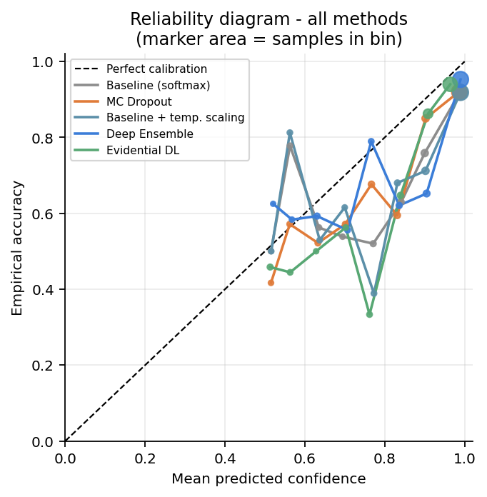
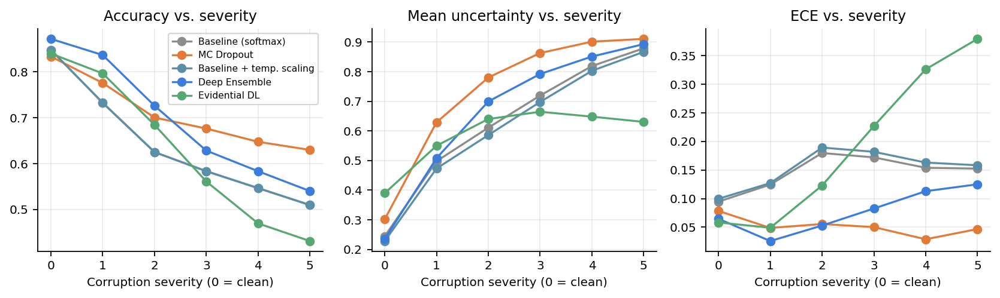
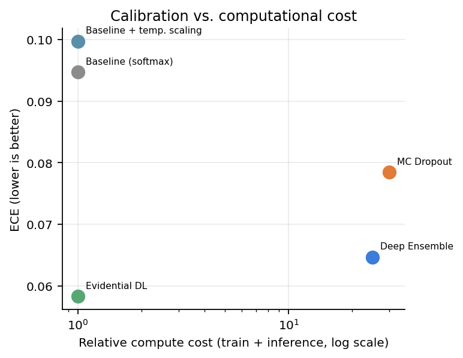
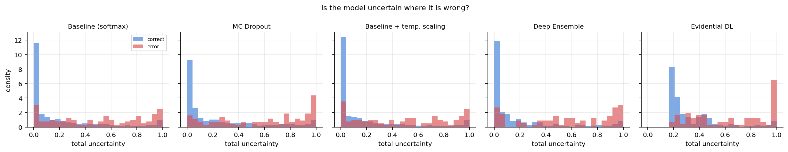

# Do you know when you don't know? Uncertainty quantification for medical imaging

[](https://github.com/lachance123-franccois/uncertainty-aware-medical-imaging/actions/workflows/tests.yml)


Version française : [README.fr.md](README.fr.md)

A neural network classifier always answers. Show it a blurred, badly exposed or
simply unusual chest X ray and softmax will still report a probability of 0.92
for pneumonia while being wrong. The model is confident and incorrect, and
nothing in its output separates that case from a textbook one. In a clinical
decision support tool this is not a performance problem but a safety problem:
the radiologist has no way to know which predictions deserve a second look.

This repository implements and compares four ways of extracting a trustworthy
uncertainty estimate from a medical image classifier, then measures whether
those uncertainties can be believed.

```bash
pip install -e ".[data]"
python -m umi.cli run-all --dataset pneumoniamnist --epochs 25 --n-members 5
```

## 1. The four strategies

| Method | Idea | Training cost | Inference cost | Epistemic uncertainty |
|:---|:---|:---|:---|:---|
| Softmax baseline | Maximum softmax probability as confidence | 1x | 1 pass | Structurally impossible |
| Temperature scaling | Divide logits by a scalar fitted on validation | 1x | 1 pass | Structurally impossible |
| MC Dropout | Keep dropout active at test time, average S passes | 1x | S passes | From dropout noise |
| Deep Ensembles | Train M independent networks and average them | Mx | M passes | From initialisation and SGD noise |
| Evidential DL | Predict a Dirichlet over the simplex, not a point | 1x | 1 pass | Closed form |

Temperature scaling is included on purpose. It is the cheapest possible
competitor, and an honest comparison has to check whether a five model ensemble
really beats one scalar fitted in two seconds.

### MC Dropout

Dropout is normally a training only regulariser. Leaving it active at inference
turns each forward pass into a sample from an approximate posterior over
weights, so S passes over the same image give S slightly different predictions
whose spread estimates the uncertainty.

Two implementation details separate a working MC Dropout from a decorative one.
Dropout is placed after every convolutional block rather than only before the
classifier, since final layer dropout perturbs almost nothing and badly
underestimates epistemic uncertainty. GroupNorm replaces BatchNorm so the
normalisation layers stay deterministic while dropout keeps sampling; with
BatchNorm the batch statistics would leak between samples and the uncertainty
would depend on batch composition.

### Deep Ensembles

M networks, same data, different random seeds, hence different initialisation,
different shuffling and different augmentation draws. Where the members agree
the prediction is safe, where they diverge the input lies outside the region
constrained by the data. No bagging is used: random restarts alone provide the
diversity, and subsampling the training set usually weakens each member.

### Evidential Deep Learning

The network outputs non negative evidence, which parameterises a Dirichlet:

$$\alpha_k = \mathrm{softplus}(z_k) + 1, \qquad S = \sum_k \alpha_k, \qquad \hat p_k = \frac{\alpha_k}{S}, \qquad u = \frac{K}{S}$$

The vacuity u tends to one when the network has collected no evidence at all.
It is the literal statement of ignorance, which softmax cannot represent because
its outputs are forced to sum to one however alien the input. Training minimises
the Bayes risk of the Brier score under the Dirichlet plus a KL term that pushes
the evidence of wrong classes back to uniform, with a weight annealed from zero
over the first ten epochs. That schedule is the main practical difficulty:
ramping it too fast collapses all evidence to zero and the model becomes
uniformly, uselessly uncertain.

## 2. Three flavours of uncertainty

Every method is reduced to the same three numbers so the comparison is fair.

| Quantity | Definition | Clinical reading |
|:---|:---|:---|
| Total | Entropy of the mean prediction | How unsure am I overall |
| Aleatoric | Mean of the entropies | Irreducible image ambiguity, get another modality |
| Epistemic | Total minus aleatoric, the mutual information | Model ignorance, this case is unlike my training data |

For the evidential model the same decomposition is available in closed form via
digamma functions, and the test suite validates it against a Monte Carlo
estimate.

## 3. How trust is measured

Calibration asks whether the confidence number is true on average. The Expected
Calibration Error bins predictions by confidence and measures the weighted gap
between accuracy and confidence. Adaptive ECE, MCE, class wise ECE, Brier score
and negative log likelihood complete the picture.

Calibration alone is not enough, since a model can be calibrated on average and
still be unable to say which individual case is wrong. The repository therefore
also measures misclassification AUROC, a Mann and Whitney test, and the risk
versus coverage curve with its area AURC, which answers the deployment question
directly: what error rate remains once the most uncertain cases are deferred to
a human reader.

Finally, every method is evaluated under seven realistic acquisition failures at
five severities: Gaussian noise, Poisson noise, blur, contrast loss,
overexposure, occlusion and resolution loss. The desirable signature is simple.
Accuracy falls and uncertainty rises together.

## 4. Results on PneumoniaMNIST

Chest X ray pneumonia versus normal, 4708 training images, 624 test images,
25 epochs, 5 ensemble members, 30 MC samples, CPU only.

### Calibration and decision quality

| Method | Accuracy | ECE | Misclassification AUROC | AURC | NLL |
|:---|:---|:---|:---|:---|:---|
| Softmax baseline | 0.8478 | 0.0948 | 0.7811 | 0.0561 | 0.4670 |
| Temperature scaling | 0.8478 | 0.0997 | 0.7811 | 0.0561 | 0.4868 |
| MC Dropout | 0.8333 | 0.0785 | 0.7939 | 0.0587 | 0.4396 |
| Deep Ensemble | **0.8718** | 0.0647 | **0.8111** | **0.0397** | 0.3762 |
| Evidential DL | 0.8397 | **0.0583** | 0.8080 | 0.0548 | **0.3740** |



Evidential DL delivers the best calibration and the best likelihood for the
price of a single forward pass, a 38 percent ECE reduction over the baseline.
Deep Ensembles dominate everything related to the decision itself, cutting AURC
by 29 percent, at the cost of five full trainings. The plain softmax baseline is
the worst calibrated configuration in the study.

### Temperature scaling fails here

The fitted factor is T = 0.939. A value below one sharpens the logits and raises
confidence, and the ECE degrades from 0.0948 to 0.0997.

The cause is structural. Validation accuracy reaches 0.947 while test accuracy
is 0.848, a ten point gap, because PneumoniaMNIST draws its validation split
from the training patients and its test split from different patients. The model
is slightly underconfident on validation and overconfident on test, so the
correction is applied in the wrong direction. Post hoc calibration fitted on
internal data does not transport outside its distribution, which is precisely
the clinical situation.

### Under distribution shift the ranking inverts

| Method | Accuracy, severity 0 | Accuracy, severity 5 | Uncertainty, severity 0 | Uncertainty, severity 5 |
|:---|:---|:---|:---|:---|
| Softmax baseline | 0.848 | 0.510 | 0.244 | 0.879 |
| Temperature scaling | 0.848 | 0.510 | 0.228 | 0.867 |
| MC Dropout | 0.833 | **0.630** | 0.302 | **0.911** |
| Deep Ensemble | 0.872 | 0.540 | 0.236 | 0.893 |
| Evidential DL | 0.840 | 0.431 | 0.390 | 0.630 |



MC Dropout becomes the most robust method: best preserved accuracy and the
uncertainty that rises highest. Evidential DL collapses, falling below the
majority class rate while its uncertainty barely moves, because vacuity is
capped by the amount of evidence the KL schedule taught the network to emit. The
same failure appears on the synthetic control dataset, so it is a property of
the formulation rather than an experimental artefact.

### Cost

| Method | Training | Inference | Measured on 624 images |
|:---|:---|:---|:---|
| Baseline, temperature scaling, evidential | 1x | 1 pass | about 2 s |
| Deep Ensemble with 5 members | 5x | 5 passes | about 6 s |
| MC Dropout with 30 samples | 1x | 30 passes | about 35 s |



### Which method should you use

No method dominates. In distribution, Evidential DL gives the best calibration
per unit of compute and Deep Ensembles the best decisions. Out of distribution,
MC Dropout is the most robust and Evidential DL the least reliable.

For a tightly controlled deployment where production data resembles training
data, the softmax baseline with a properly validated temperature is enough. For
an open environment where out of distribution inputs are likely, Deep Ensembles
are the safest choice when the training budget allows, and MC Dropout an
acceptable fallback applicable to an already trained model. Evidential DL offers
the best calibration to cost ratio but should not be deployed without a
complementary detection mechanism.

The synthetic control makes the point sharper. On data where errors are
aleatoric by construction and no shift exists, the plain baseline obtains the
best ECE of all methods, 0.0242 against 0.0356 for evidential. Where there is no
ignorance to measure, epistemic machinery buys nothing.



Overlapping histograms would mean the uncertainty cannot flag errors. The red
error mass sitting to the right of the blue correct mass is what a useful
uncertainty looks like.

## 5. Installation

```bash
git clone https://github.com/USERNAME/REPO.git
cd REPO
python -m venv .venv && source .venv/bin/activate
pip install -e ".[data,dev]"
```

CPU is enough: the default backbone has about 300k parameters so that training
five ensemble members stays a coffee break job. If no download is available,
everything runs on a built in synthetic lesion dataset whose Bayes error rate is
known by construction, 25 percent of the positives carrying a deliberately low
contrast lesion.

## 6. Usage

```bash
python -m umi.cli run-all --dataset pneumoniamnist --epochs 25 --n-members 5
python -m umi.cli run-all --dataset synthetic --epochs 3 --out runs/smoke
python -m umi.cli train --method deep_ensemble --n-members 5 --out runs/exp1
python -m umi.cli evaluate --out runs/exp1 --uncertainty epistemic --corruption blur
python -m umi.cli maps --out runs/exp1 --method evidential --n-images 8
```

Datasets: pneumoniamnist, breastmnist, dermamnist, octmnist, bloodmnist,
synthetic. Users of an IDE can run `scripts/run_demo.py` directly, which calls
the CLI with hardcoded arguments and needs no command line.

Each run writes REPORT.md with tables and conclusions, results.json with every
metric, predictions.npz with probabilities and uncertainties, config.json with
the exact hyperparameters, plus checkpoints and figures.

## 7. Repository layout

```
src/umi/
  data.py           MedMNIST loaders and synthetic lesion generator
  corruptions.py    seven acquisition shifts at five severities
  models.py         SmallCNN, ResNet18 and enable_mc_dropout
  losses.py         cross entropy and evidential losses with KL annealing
  methods.py        the four predictors behind one interface
  uncertainty.py    total, aleatoric, epistemic and Dirichlet vacuity
  calibration.py    ECE variants, Brier, NLL, temperature scaling
  metrics.py        misclassification AUROC, risk coverage, Mann and Whitney
  maps.py           occlusion based spatial uncertainty maps
  viz.py            reliability diagrams, overlays, comparison plots
  train.py          training loop, ensembles, checkpointing
  evaluate.py       orchestration and report generation
  cli.py            train, evaluate, maps, run-all
tests/              49 tests covering the maths and the pipeline
article/            LaTeX report of the study
```

The test suite is not decoration. It checks the Dirichlet closed forms against
Monte Carlo estimates, that temperature scaling recovers a known scaling factor,
that a perfectly calibrated synthetic population gets an ECE near zero, and that
epistemic uncertainty is exactly zero for a deterministic model.

## 8. A bug worth documenting

An early set of results showed the baseline and its temperature scaled version
with different accuracies, 0.8478 against 0.8349. Temperature scaling is a
strictly monotone transformation of the logits and cannot change the predicted
class, so the two values had to be identical.

The cause was that predictors shared the same network object in memory, and the
MC Dropout predictor put the dropout layers back into stochastic mode without
ever restoring them. Any deterministic predictor evaluated afterwards inherited
active dropout. The fix reasserts evaluation mode on every batch, and a
regression test now guards it.

The lesson generalises. The most dangerous errors raise no exception, they
produce plausible numbers. Only a known invariant, here the mandatory equality
of two accuracies, exposes them.

## 9. Limitations

MedMNIST is 28 by 28, so the relative ranking of methods probably transports but
absolute ECE values on full resolution images will differ. A single seed was
used for the baseline, and part of the apparent ensemble advantage may come from
initialisation variance, so a three seed repetition is needed before treating
small gaps as significant. Occlusion maps answer which region carries the
evidence, not which pixel is uncertain. The shifts remain synthetic, and real
scanner or site shift is harsher than added Gaussian noise. Nothing here is a
medical device.

## 10. References

1. Gal and Ghahramani. Dropout as a Bayesian Approximation. ICML 2016.
2. Lakshminarayanan, Pritzel and Blundell. Simple and Scalable Predictive Uncertainty Estimation using Deep Ensembles. NeurIPS 2017.
3. Sensoy, Kaplan and Kandemir. Evidential Deep Learning to Quantify Classification Uncertainty. NeurIPS 2018.
4. Guo, Pleiss, Sun and Weinberger. On Calibration of Modern Neural Networks. ICML 2017.
5. Ovadia et al. Can You Trust Your Model's Uncertainty? NeurIPS 2019.
6. Kendall and Gal. What Uncertainties Do We Need in Bayesian Deep Learning for Computer Vision? NeurIPS 2017.
7. Yang et al. MedMNIST v2. Scientific Data 2023.

## License

MIT, see [LICENSE](LICENSE).